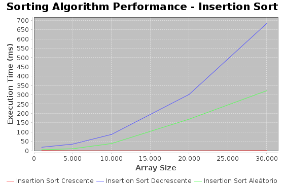
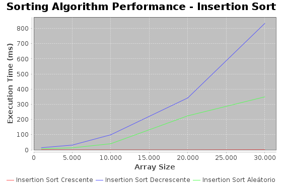
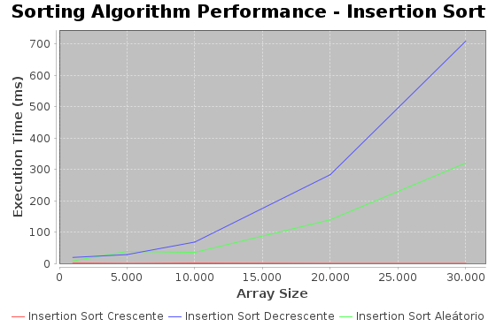

# Relatório de Testes de Algoritmos de Ordenação

## Testes Insertion Sort:

### Teste 1:

### Teste 2:

### Teste 3:

## Testes Selection Sort:

### Teste 1:

### Teste 2:

### Teste 3:

Descrição ou legenda para o Teste 2.

## Testes Bubble Sort:

### Teste 1:

### Teste 2:

### Teste 3:

